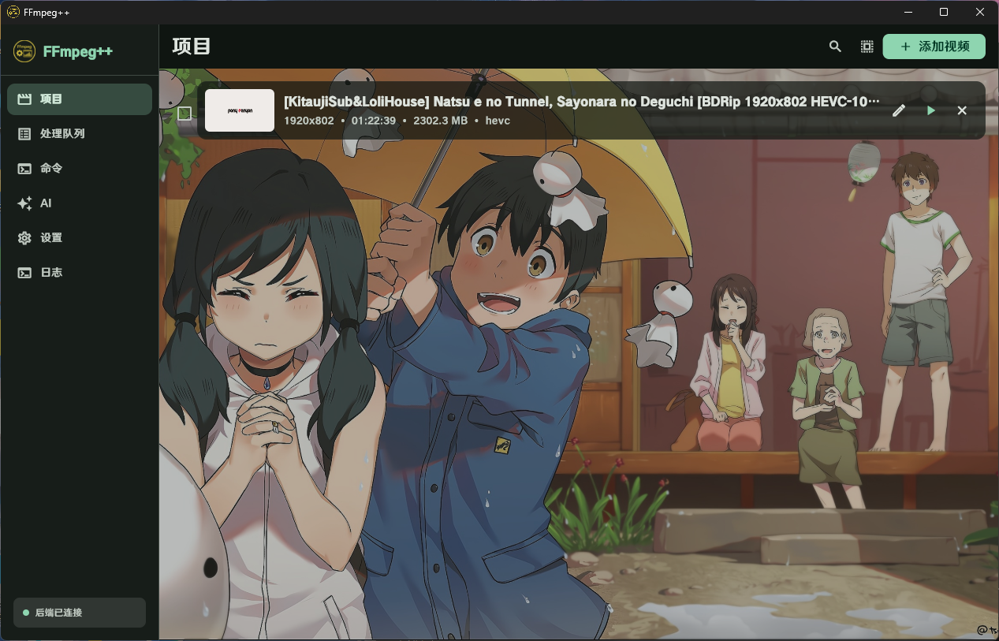
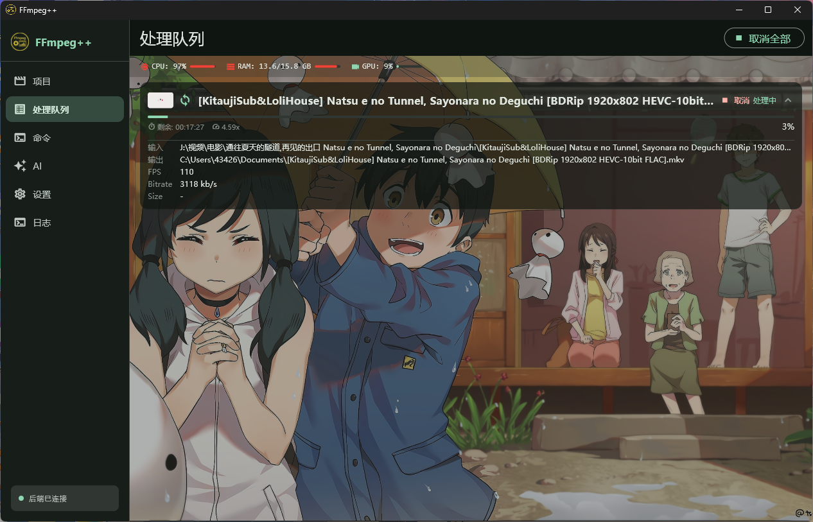

# 🎬 FFmpeg++

<div align="center">

**现代化视频处理桌面应用 — 100% AI 生成代码**

[](https://www.microsoft.com/windows)
[](https://flutter.dev)
[](https://python.org)
[](https://ffmpeg.org)
[](LICENSE)

</div>

---

## 📸 软件预览

<table>
  <tr>
    <td align="center"><b>🎬 主界面</b></td>
    <td align="center"><b>📋 使用演示</b></td>
  </tr>
  <tr>
    <td></td>
    <td></td>
  </tr>
</table>

---

## 📖 概述

FFmpeg++ 将 FFmpeg 强大的命令行能力封装为直观的桌面 GUI。采用 **Flutter**（Material Design 3 前端）+ **Python**（Nuitka 编译后端）架构，通过 stdin/stdout JSON 协议通信。

> 🤖 **本项目 100% 由 AI 生成** — ，从 Flutter 界面到 Python 后端。通过人类引导与 AI 的迭代协作完成。

---

## 🏗 架构

```
┌──────────────────────────────────┐
│   Flutter 桌面 GUI (Dart)        │  ← Material Design 3
│   stdin/stdout JSON 协议         │
├──────────────────────────────────┤
│   C++    后端 (server.dist/)     │  ← Nuitka standalone
│   subprocess → ffmpeg / ffprobe  │
├──────────────────────────────────┤
│   FFmpeg / FFprobe               │  ← 外部依赖（用户自行安装）
└──────────────────────────────────┘
```

---

## ✨ 功能特性

| 模块 | 说明 |
|------|------|
| 🎬 **项目管理** | 多视频导入、ffprobe 自动探测、缩略图预览 |
| 📋 **处理队列** | 顺序批量处理、ffmpeg stderr 实时进度解析 |
| 🎞 **视频转码** | 28 种编码器（H.264/H.265/AV1/VP9/ProRes/FFV1），GPU 加速（NVIDIA/AMD/Intel）|
| 🎵 **音频处理** | AAC / MP3 / Opus / FLAC 编码，声道选择 |
| 📝 **字幕烧录** | 烧录外挂 SRT/ASS/SSA 或内嵌字幕轨道 |
| 🧠 **命令行** | 手动输入 ffmpeg 命令 + 内置参数参考 |
| 🤖 **AI 助手** | DeepSeek / OpenAI 兼容 API，自然语言生成命令 |
| ⚙️ **个性化设置** | 暗/亮主题、55+ 字体、7 种主题色 + HSV 拾色器、背景图片、卡片 3D 效果 |

---

## 📦 安装

### 方式一：安装包（推荐）

1. 从 [Releases](https://github.com/pity-Fox/FFmpeg_plus_plus/releases) 下载最新版 `FFmpeg++_v*_setup.exe`
2. 运行安装程序
3. 确保已安装 [FFmpeg](https://ffmpeg.org/download.html) 并加入 PATH 环境变量

---

## 🔧 开发(自行构建)

### 环境要求

| 依赖 | 版本 |
|------|------|
| Windows | 10/11（需启用开发者模式）|
| Flutter SDK | 3.44+ |
| Python | 3.11+ |
| FFmpeg | 8.0+（需在 PATH 中）|
| Inno Setup | 6+（构建安装包时需要）|

### 快速开始

```bash
# 1. 编译 Python 后端（standalone，秒级启动）
cd ffmpeg_video_tool
python -m nuitka --standalone --include-package=backend --include-package=backend.utils \
    --output-filename=server.exe server.py

# 2. 启动 Flutter GUI
cd ffmpegpp_gui
flutter pub get
flutter run -d windows
```

### 生产构建

```bash
# 1. 编译后端
cd ffmpeg_video_tool
python -m nuitka --standalone --include-package=backend --include-package=backend.utils \
    --output-filename=server.exe server.py

# 2. 构建 Flutter
cd ffmpegpp_gui
flutter build windows --release

# 3. 组装输出
mkdir ..\..\build
cp -r build\windows\x64\runner\Release\* ..\..\build\
cp -r ..\server.dist ..\..\build\

# 4. 使用 Inno Setup 构建安装包
# 在 Inno Setup Compiler 中打开 make/setup.iss 并编译
```

---

## 📁 项目结构

```
FFmpeg_plus_plus/
├── ffmpegpp_gui/                  # Flutter 桌面应用
│   ├── lib/
│   │   ├── main.dart              # 入口 + 崩溃日志
│   │   ├── app.dart               # MaterialApp + 主题 + 窗口
│   │   ├── theme/                 # MD3 主题、国际化字符串
│   │   ├── models/                # 数据模型
│   │   ├── services/              # Python 进程、后端客户端、配置
│   │   ├── providers/             # AppState (ChangeNotifier)
│   │   ├── pages/                 # 页面（项目/队列/命令/AI/设置）
│   │   └── widgets/               # 侧边栏、视频卡片、任务卡片、配置弹窗
│   ├── windows/                   # Windows 原生配置 + Runner
│   └── pubspec.yaml
├── server_cpp/                    # C++ 后端
│   ├── src/                       # 源代码
│   ├── include/                   # 头文件
│   ├── CMakeLists.txt             # CMake 构建配置
│   └── build_server.bat           # 快速编译脚本
├── make/                          # 安装包资源
│   ├── app_icon.ico               # 应用图标
│   ├── setup.iss                  # Inno Setup 安装脚本
│   └── requirements.txt           # Python 依赖
├── build/                         # 构建输出（编译后生成）
│   ├── ffmpegpp_gui.exe           # Flutter GUI
│   ├── data/                      # Flutter AOT 资源
│   └── server.dist/               # Python 后端（standalone）
├── rel/                           # 发布资源
│   ├── view.png                   # 软件主界面截图
│   └── view1.png                  # 软件使用演示截图
├── LICENSE                        # MIT 许可证
└── README.md                      # 本文件
```

---

## 🛠 技术栈

| 层级 | 技术 |
|------|------|
| UI 框架 | Flutter 3.44, Material Design 3 |
| 状态管理 | Provider (ChangeNotifier) |
| 后端 | Python 3.11 + C++ 17（双后端架构）|
| 编译工具 | Nuitka（Python）/ MSVC（C++）|
| 视频引擎 | FFmpeg 8.0 / ffprobe |
| AI 集成 | DeepSeek API / OpenAI 兼容 |
| 安装包 | Inno Setup 6 |
| 代码生成 | 100% AI 生成|

---

## ⭐ Star 历史

<a href="https://star-history.com/#pity-Fox/FFmpeg_plus_plus&Date">
  <picture>
    <source media="(prefers-color-scheme: dark)" srcset="https://api.star-history.com/svg?repos=pity-Fox/FFmpeg_plus_plus&type=Date&theme=dark" />
    <source media="(prefers-color-scheme: light)" srcset="https://api.star-history.com/svg?repos=pity-Fox/FFmpeg_plus_plus&type=Date" />
    
  </picture>
</a>

---

## 📄 许可证

MIT License — 详见 [LICENSE](LICENSE)

---

<div align="center">
  <sub>🤖 100% AI-Generated — Built with Flutter + FFmpeg + Claude</sub>
</div>
